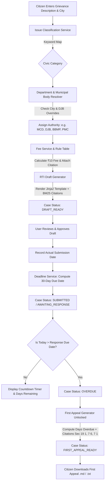

# 🏛️ Civic RTI & First Appeal Drafter — Comprehensive Architectural & Operational Explainer

---

## 📑 Table of Contents
1. [Executive Overview: What is this Project?](#1-executive-overview-what-is-this-project)
2. [The Core Civic Problem & RTI Act 2005](#2-the-core-civic-problem--rti-act-2005)
3. [Design Philosophy: Why Zero-LLM & Pure Determinism?](#3-design-philosophy-why-zero-llm--pure-determinism)
4. [Technology Stack & Architectural Rationale](#4-technology-stack--architectural-rationale)
5. [End-to-End Workflow & Data Flow Architecture](#5-end-to-end-workflow--data-flow-architecture)
6. [Comprehensive File-by-File Breakdown](#6-comprehensive-file-by-file-breakdown)
7. [In-Depth Real-World Examples](#7-in-depth-real-world-examples)
8. [What All You Can Do With This Project](#8-what-all-you-can-do-with-this-project)
9. [Statutory Provisions Grounding the Engine](#9-statutory-provisions-grounding-the-engine)
10. [5 Key Failure Points & Robust Engineering Hardening](#10-5-key-failure-points--robust-engineering-hardening)

---

## 1. Executive Overview: What is this Project?

The **Civic RTI & First Appeal Drafter** is an autonomous, local-first legal and civic workflow automation engine written in Python.

It enables Indian citizens, Resident Welfare Associations (RWAs), civic journalists, and grassroots activists to transform everyday civic grievances (e.g., overflowing garbage dumps, hazardous road potholes, dark streetlights, contaminated drinking water, sewer blockages) into legally enforceable, structured **Right to Information (RTI) Applications** and **Statutory First Appeals**.

### 🌟 Core Value Propositions
- **Zero Cloud / External AI Dependency:** Operates 100% locally on your machine with SQLite, FastAPI, and Streamlit without sending sensitive citizen data to third-party paid APIs or cloud vector databases.
- **Strict Determinism:** Municipal routing, civic issue classification, fee calculation, and statutory deadlines are computed using pure mathematical logic and static rule engines, eliminating hallucinations.
- **BM25 Legal Grounding (RAG):** Uses local lexical Information Retrieval (`rank_bm25`) strictly to attach verbatim statutory sections from the *Right to Information Act, 2005* and State RTI Rules.
- **Automated 30-Day Deadline Clock:** Tracks the exact statutory deadline under Section 7(1) and automatically unlocks **First Appeal** drafting under Section 19(1) with mandatory demands for *free records* under Section 7(6) once a case becomes overdue.

---

## 2. The Core Civic Problem & RTI Act 2005

In India, municipal complaints made on citizen portals or informal complaint registers often languish without accountability. However, filing an application under the **Right to Information (RTI) Act, 2005** shifts the legal balance:

| Standard Informal Grievance | RTI Act, 2005 Statutory Application |
|---|---|
| No binding legal deadline for government response | **Strict 30-day response mandate** under Section 7(1) |
| Government officers face no personal penalty | **Personal fine of ₹250/day (up to ₹25,000)** on the PIO under Section 20(1) for delay/refusal |
| Often bounced across departments without notice | **Mandatory 5-day transfer obligation** under Section 6(3) to the concerned authority |
| Citizens must repeatedly follow up informally | Right to file a **Statutory First Appeal** under Section 19(1) and demand **free records** under Section 7(6) |

### Why an automated drafting engine is needed:
Most citizens do not know:
1. Which specific municipal body governs their locality (e.g., MCD vs. Delhi Jal Board in Delhi).
2. The exact application fee and fee rules (e.g., ₹10 standard application fee, BPL exemptions).
3. How to phrase questions so that public authorities cannot easily evade them.
4. How to track the exact 30-day statutory response clock and draft a First Appeal once the deadline lapses.

This project automates this entire lifecycle end-to-end.

---

## 3. Design Philosophy: Why Zero-LLM & Pure Determinism?

Modern generative AI / Large Language Models (LLMs) suffer from several critical failure modes when applied to administrative law:
1. **Hallucination of Legal Deadlines & Fees:** An LLM might invent a 15-day or 45-day deadline or guess an incorrect fee amount (e.g., ₹50 instead of statutory ₹10).
2. **Fabrication of Public Officials:** Generative models often invent plausible-sounding officer names or office addresses that do not exist.
3. **Data Privacy Risks:** Citizens typing sensitive local grievance descriptions should not have their data sent to third-party proprietary cloud LLM APIs.
4. **Cost & Infrastructure Overhead:** Vector databases (Chroma, Pinecone, FAISS) and embedding models require heavy dependencies, GPU memory, or subscription costs.

### Our Solution:
- **Core Operations = 100% Deterministic Code:** Classification is keyword-based; routing is dictionary-based; deadlines use calendar date arithmetic (`timedelta(days=30)`).
- **RAG = Lexical Grounding Only:** BM25 is used exclusively to fetch exact statutory paragraphs (Sections 6(1), 6(3), 7(1), 7(6), 19(1), etc.) from SQLite.
- **Safety First:** The system explicitly inserts placeholders (`[APPLICANT NAME — PLACEHOLDER]`, `[OFFICE ADDRESS — PLACEHOLDER]`) and the mandatory disclaimer: *"This is a drafting assistant and does not provide legal advice."*

---

## 4. Technology Stack & Architectural Rationale

```
+-------------------------------------------------------------------------+
|                              USER INTERFACE                             |
|    +----------------------------------+  +-------------------------+    |
|    |      Streamlit Web Dashboard     |  |   Interactive CLI Tool  |    |
|    |    (frontend/streamlit_app.py)   |  |     (scripts/cli.py)    |    |
|    +----------------------------------+  +-------------------------+    |
+-------------------------------------------------------------------------+
                                     |
                                     v
+-------------------------------------------------------------------------+
|                           FASTAPI REST BACKEND                          |
|         app/main.py  |  app/routers/cases.py  |  app/routers/legal.py   |
+-------------------------------------------------------------------------+
                                     |
                                     v
+-------------------------------------------------------------------------+
|                        DETERMINISTIC SERVICE LAYER                      |
|  +--------------------+ +---------------------+ +--------------------+  |
|  |   issue_service    | | department_service  | |    fee_service     |  |
|  +--------------------+ +---------------------+ +--------------------+  |
|  +--------------------+ +---------------------+ +--------------------+  |
|  |  deadline_service  | |    draft_service    | |   appeal_service   |  |
|  +--------------------+ +---------------------+ +--------------------+  |
|  +--------------------+ +--------------------------------------------+  |
|  |    case_service    | |    rag/retriever.py (BM25Okapi Local RAG)  |  |
|  +--------------------+ +--------------------------------------------+  |
+-------------------------------------------------------------------------+
                                     |
                                     v
+-------------------------------------------------------------------------+
|                             DATA & STORAGE                              |
|   +------------------------------------+  +-------------------------+   |
|   |         SQLite (civic_rti.db)      |  |  Knowledge Base JSONL   |   |
|   |  - cases, rti_drafts, appeal_drafts|  |  - rti_act_2005.jsonl   |   |
|   |  - case_events, legal_chunks       |  |  - delhi_rti_rules.jsonl|   |
|   +------------------------------------+  +-------------------------+   |
+-------------------------------------------------------------------------+
```

| Technology | Role in Project | Why We Chose It |
|---|---|---|
| **Python 3.11+** | Core Programming Language | Clean syntax, robust standard library (`datetime`, `re`, `json`, `math`), extensive ecosystem. |
| **FastAPI** | REST API Backend | High performance async ASGI framework, native Pydantic type safety, auto-generated Swagger OpenAPI docs. |
| **Uvicorn** | ASGI Web Server | Lightning-fast asynchronous server for local execution and dev reloading. |
| **SQLite + SQLAlchemy 2.0** | Database & ORM | Zero-configuration, local file storage (`civic_rti.db`). Configured with WAL mode and 30s timeout for smooth multi-threaded concurrency. |
| **Pydantic v2** | Request/Response Validation | Strict schema enforcement, automated validation errors, structured JSON serialization. |
| **Jinja2** | Template Engine | Declarative Markdown generation for RTI applications and First Appeals. |
| **`rank_bm25` (+ Built-in Fallback)** | Information Retrieval | State-of-the-art lexical search algorithm (BM25Okapi) without requiring neural embeddings or vector databases. Includes a pure-Python fallback. |
| **Streamlit** | Web Frontend | Multi-tab UI for citizen intake, live draft review, deadline countdown tracking, and KB search. |
| **Pytest** | Test Automation | Fast, fixture-driven testing suite covering 100% of services, API routes, and edge cases. |

---

## 5. End-to-End Workflow & Data Flow Architecture



---

## 6. Comprehensive File-by-File Breakdown

### 📂 Root Directory
- **[`README.md`](file:///m:/Projects/RTI-RAG%20-%20Copy/README.md):** Project overview, quickstart instructions, API endpoint reference, CLI commands, and statutory disclaimer.
- **[`requirements.txt`](file:///m:/Projects/RTI-RAG%20-%20Copy/requirements.txt):** Pinned dependencies (`fastapi`, `uvicorn`, `sqlalchemy`, `pydantic`, `jinja2`, `rank-bm25`, `streamlit`, `pytest`, `httpx`, `requests`).
- **[`pytest.ini`](file:///m:/Projects/RTI-RAG%20-%20Copy/pytest.ini):** Test configuration setting `pythonpath = .` and test discovery paths.
- **[`plan.md`](file:///m:/Projects/RTI-RAG%20-%20Copy/plan.md):** The original engineering specification and non-negotiable architectural constraints.

---

### 📂 Database & Core Application Layer (`app/`)

#### 1. [`app/database.py`](file:///m:/Projects/RTI-RAG%20-%20Copy/app/database.py)
- **Role:** SQLite database connection manager and session factory.
- **Key Implementation:**
  - Creates SQLAlchemy engine bound to `sqlite:///./civic_rti.db`.
  - Attaches SQLite `PRAGMA journal_mode=WAL` (Write-Ahead Logging) and `PRAGMA synchronous=NORMAL` to eliminate file locks when FastAPI and Streamlit access the database concurrently.
  - Exposes `get_db()` dependency generator and `db_context()` context manager.

#### 2. [`app/models.py`](file:///m:/Projects/RTI-RAG%20-%20Copy/app/models.py)
- **Role:** SQLAlchemy database schema definitions (`Case`, `RTIDraft`, `AppealDraft`, `CaseEvent`, `LegalChunk`).

#### 3. [`app/schemas.py`](file:///m:/Projects/RTI-RAG%20-%20Copy/app/schemas.py)
- **Role:** Pydantic v2 data models for API validation and serialization.

#### 4. [`app/main.py`](file:///m:/Projects/RTI-RAG%20-%20Copy/app/main.py)
- **Role:** FastAPI application factory, middleware, and lifecycle manager.

---

### 📂 Routers (`app/routers/`)

#### 5. [`app/routers/cases.py`](file:///m:/Projects/RTI-RAG%20-%20Copy/app/routers/cases.py)
- **Role:** REST API endpoints managing case lifecycle (`POST /cases`, `GET /cases`, `PATCH /cases/{id}`, `DELETE /cases/{id}`, `POST /cases/{id}/draft`, `POST /cases/{id}/approve`, `POST /cases/{id}/submit`, `POST /cases/{id}/appeal`, `GET /cases/{id}/events`).

#### 6. [`app/routers/legal.py`](file:///m:/Projects/RTI-RAG%20-%20Copy/app/routers/legal.py)
- **Role:** REST API endpoints for legal knowledge base exploration (`GET /legal/chunks`, `GET /legal/chunks/{id}`, `GET /legal/search`).

---

### 📂 Deterministic Services (`app/services/`)

#### 7. [`app/services/issue_service.py`](file:///m:/Projects/RTI-RAG%20-%20Copy/app/services/issue_service.py)
- **Role:** Pure deterministic keyword classification with Unicode and punctuation normalization.

#### 8. [`app/services/department_service.py`](file:///m:/Projects/RTI-RAG%20-%20Copy/app/services/department_service.py)
- **Role:** Municipal authority mapping with Delhi Jal Board (DJB) overrides.

#### 9. [`app/services/fee_service.py`](file:///m:/Projects/RTI-RAG%20-%20Copy/app/services/fee_service.py)
- **Role:** Rule-based application fee calculation.

#### 10. [`app/services/deadline_service.py`](file:///m:/Projects/RTI-RAG%20-%20Copy/app/services/deadline_service.py)
- **Role:** Pure calendar date arithmetic for statutory deadlines with resilient multi-format date parsing (`YYYY-MM-DD`, `DD-MM-YYYY`, etc.).

#### 11. [`app/services/draft_service.py`](file:///m:/Projects/RTI-RAG%20-%20Copy/app/services/draft_service.py)
- **Role:** RTI Application generator with input sanitization.

#### 12. [`app/services/appeal_service.py`](file:///m:/Projects/RTI-RAG%20-%20Copy/app/services/appeal_service.py)
- **Role:** First Appeal generator with strict overdue validation and input sanitization.

#### 13. [`app/services/case_service.py`](file:///m:/Projects/RTI-RAG%20-%20Copy/app/services/case_service.py)
- **Role:** Central orchestration service with atomic rollback protection and audit logging.

---

### 📂 BM25 RAG Knowledge Base Layer (`app/rag/` & `kb/data/`)

#### 14. [`app/rag/retriever.py`](file:///m:/Projects/RTI-RAG%20-%20Copy/app/rag/retriever.py)
- **Role:** Singleton legal chunk search and retrieval engine with pure Python `BM25Okapi` fallback.

#### 15. [`app/rag/seed_kb.py`](file:///m:/Projects/RTI-RAG%20-%20Copy/app/rag/seed_kb.py)
- **Role:** Database seeder for statutory chunks.

#### 16. [`kb/data/rti_act_2005.jsonl`](file:///m:/Projects/RTI-RAG%20-%20Copy/kb/data/rti_act_2005.jsonl) & [`kb/data/delhi_rti_rules.jsonl`](file:///m:/Projects/RTI-RAG%20-%20Copy/kb/data/delhi_rti_rules.jsonl)
- **Role:** Raw statutory knowledge base containing statutory chunks.

---

### 📂 Templates (`app/templates/`)

#### 17. [`app/templates/rti_template.md`](file:///m:/Projects/RTI-RAG%20-%20Copy/app/templates/rti_template.md)
- Jinja2 template for Section 6(1) RTI applications.

#### 18. [`app/templates/appeal_template.md`](file:///m:/Projects/RTI-RAG%20-%20Copy/app/templates/appeal_template.md)
- Jinja2 template for Section 19(1) First Appeals.

---

### 📂 Frontend & CLI (`frontend/` & `scripts/`)

#### 19. [`frontend/streamlit_app.py`](file:///m:/Projects/RTI-RAG%20-%20Copy/frontend/streamlit_app.py)
- 6-tab Streamlit dashboard for citizen intake, drafting, deadline tracking, first appeal, audit logs, and KB search.

#### 20. [`scripts/cli.py`](file:///m:/Projects/RTI-RAG%20-%20Copy/scripts/cli.py)
- Command-line interface offering terminal commands: `create`, `draft`, `submit`, `appeal`, `list`, `search-legal`.

#### 21. [`scripts/seed_demo_data.py`](file:///m:/Projects/RTI-RAG%20-%20Copy/scripts/seed_demo_data.py)
- Demo data seeder for sample cases.

---

### 📂 Test Suite (`tests/`)

- [`test_issue_service.py`](file:///m:/Projects/RTI-RAG%20-%20Copy/tests/test_issue_service.py), [`test_department_service.py`](file:///m:/Projects/RTI-RAG%20-%20Copy/tests/test_department_service.py), [`test_fee_service.py`](file:///m:/Projects/RTI-RAG%20-%20Copy/tests/test_fee_service.py), [`test_deadline_service.py`](file:///m:/Projects/RTI-RAG%20-%20Copy/tests/test_deadline_service.py), [`test_retriever.py`](file:///m:/Projects/RTI-RAG%20-%20Copy/tests/test_retriever.py), [`test_draft_service.py`](file:///m:/Projects/RTI-RAG%20-%20Copy/tests/test_draft_service.py), [`test_appeal_service.py`](file:///m:/Projects/RTI-RAG%20-%20Copy/tests/test_appeal_service.py), [`test_case_service.py`](file:///m:/Projects/RTI-RAG%20-%20Copy/tests/test_case_service.py), [`test_api.py`](file:///m:/Projects/RTI-RAG%20-%20Copy/tests/test_api.py), [`test_robustness.py`](file:///m:/Projects/RTI-RAG%20-%20Copy/tests/test_robustness.py).

---

## 7. In-Depth Real-World Examples

### Example 1: Contaminated Water Grievance in Delhi
```text
Citizen Input: "Foul smelling dirty tap water coming in our colony in Hauz Khas"
City: "Delhi"
```

1. **Classification:** `"water"` → `issue_type`: `"water_supply"`
2. **Municipal Routing Override:** `"Delhi"` + `"water_supply"` → Municipal Body: `"Delhi Jal Board (DJB)"` (overriding MCD).
3. **Fee Calculation:** `₹10` with `delhi-r5-fee` citation attached.
4. **Draft Generation:** RTI drafted with Section 6(3) 5-day transfer demand and 30-day notice under Section 7(1).
5. **Submission & Deadlines:**
   - Submitted: `2026-08-20` → Due Date: `2026-09-19` → Overdue From: `2026-09-20`
6. **First Appeal Generation (Evaluated on `2026-09-25`):**
   - System calculates `6 days overdue`.
   - Generates First Appeal demanding records **free of charge** under Section 7(6).

---

### Example 2: Dangerous Potholes in Pune
```text
Citizen Input: "Severe potholes on road near station causing accidents"
City: "Pune"
```
1. **Classification:** `"road_maintenance"`
2. **Department:** `"Roads / Public Works"`
3. **Municipal Body:** `"PMC"` (Pune Municipal Corporation)
4. **Fee:** `₹10` (`INR`)

---

## 8. What All You Can Do With This Project

### 🧑‍💼 For Individual Citizens:
- Draft professionally formatted RTI applications for local civic issues in seconds.
- Automatically calculate statutory deadlines and receive reminders when cases become overdue.
- Generate legally grounded First Appeals without hiring an advocate.

### 🏘️ For Resident Welfare Associations (RWAs) & Societies:
- Track community civic issues (water supply, streetlights, garbage) in a centralized local database.
- Maintain a timestamped audit trail of all government correspondence.

### 📰 For Civic Journalists & Grassroots Activists:
- Script batch RTI filings using the CLI tool ([`scripts/cli.py`](file:///m:/Projects/RTI-RAG%20-%20Copy/scripts/cli.py)).
- Query the legal knowledge base to reference relevant RTI Act sections.

### 💻 For Developers & Researchers:
- Integrate with the FastAPI REST API to build mobile apps, Telegram bots, or WhatsApp civic grievance bots.
- Run 100% locally with zero cloud dependencies or API keys.

---

## 9. Statutory Provisions Grounding the Engine

| Statutory Section | Legal Meaning | Project Implementation |
|---|---|---|
| **Section 6(1)** | Right of any citizen to request information from a public authority. | Forms the statutory basis of all generated RTI drafts. |
| **Section 6(2)** | Citizen is not required to provide reasons for asking information. | Ensures drafts remain objective and legally sound. |
| **Section 6(3)** | Mandatory 5-day transfer to the concerned authority if filed with wrong department. | Included as standard query #4 in every RTI draft. |
| **Section 7(1)** | Public Information Officer must reply within **30 days**. | Computes statutory response due date via date arithmetic. |
| **Section 7(6)** | If information is delayed beyond 30 days, it must be provided **free of cost**. | Injected as a mandatory relief demand in First Appeals. |
| **Section 7(8)** | Rejection notices must state reasons and appellate authority details. | Referenced in knowledge base. |
| **Section 19(1)** | Right to file a **First Appeal** within 30 days of non-response or rejection. | Forms the statutory basis of all generated First Appeals. |
| **Section 19(3)** | Right to file a **Second Appeal** with Information Commission within 90 days. | Referenced in knowledge base. |
| **Section 20(1)** | Personal penalty of **₹250/day (up to ₹25,000)** on defaulting PIO. | Referenced in knowledge base. |
| **Delhi RTI Rule 5** | Fixed ₹10 application fee with BPL exemptions. | Automated in fee engine with citations. |

---

## 10. 5 Key Failure Points & Robust Engineering Hardening

To guarantee that the application never crashes, leaks database locks, or miscalculates statutory dates under hostile, noisy, or edge-case conditions, 5 critical failure modes were identified and hardened:

### 🛡️ Failure Point 1: Date Parsing & Input Format Fragility
- **The Collapse Risk:** Citizens often input dates in varying formats (`20-08-2026`, `20/08/2026`, `2026/08/20`, ISO timestamp strings, or empty/padded strings). Standard strict ISO parsing crashes with unhandled `ValueError` (HTTP 500 in FastAPI).
- **The Hardening Fix ([`app/services/deadline_service.py`](file:///m:/Projects/RTI-RAG%20-%20Copy/app/services/deadline_service.py)):**
  - Implemented multi-format resilient date parser `_parse_date()` that parses ISO timestamps, Indian/UK format (`DD-MM-YYYY`, `DD/MM/YYYY`), US format (`MM/DD/YYYY`), and standard variations.
  - Rejects blank, null, or invalid strings with clear domain exceptions translated to HTTP 400/422 responses.

---

### 🛡️ Failure Point 2: SQLite Concurrency & Database Locking
- **The Collapse Risk:** Running Streamlit and FastAPI concurrently across multiple user threads can cause `sqlite3.OperationalError: database is locked` if sessions are unclosed or uncommitted during runtime errors.
- **The Hardening Fix ([`app/database.py`](file:///m:/Projects/RTI-RAG%20-%20Copy/app/database.py)):**
  - Configured SQLite connection with `PRAGMA journal_mode=WAL` (Write-Ahead Logging) and `PRAGMA synchronous=NORMAL`.
  - Added `timeout=30` to connection arguments.
  - Implemented `db_context()` context manager with automatic rollback on exception and guaranteed session cleanup.

---

### 🛡️ Failure Point 3: Template Injection & Formatting Glitches
- **The Collapse Risk:** Citizen grievance text containing Jinja2 syntax (e.g. `{{ ... }}`, ``), null bytes (`\x00`), HTML tags, or unescaped control characters could break template compilation or corrupt output files.
- **The Hardening Fix ([`app/services/draft_service.py`](file:///m:/Projects/RTI-RAG%20-%20Copy/app/services/draft_service.py), [`app/services/appeal_service.py`](file:///m:/Projects/RTI-RAG%20-%20Copy/app/services/appeal_service.py)):**
  - Added `_sanitize_text()` to strip non-printable control characters, null bytes, and normalize line breaks.
  - Passed user inputs as safe string literals into Jinja templates.

---

### 🛡️ Failure Point 4: Unicode & Punctuation Edge Cases in NLP/BM25
- **The Collapse Risk:** Complex citizen inputs with attached punctuation (`pothole,`, `garbage/waste`), emojis, or search queries with only special symbols (`!@#$%`) could cause tokenization failures or zero-division errors in BM25 math (`avgdl = 0` or division by zero).
- **The Hardening Fix ([`app/services/issue_service.py`](file:///m:/Projects/RTI-RAG%20-%20Copy/app/services/issue_service.py), [`app/rag/retriever.py`](file:///m:/Projects/RTI-RAG%20-%20Copy/app/rag/retriever.py)):**
  - Added Unicode `NFKD` normalization and punctuation cleaning before word matching in `issue_service.py`.
  - Added epsilon guards (`avgdl or 1.0`, zero-size corpus checks) and empty-query fallback handling in `BM25Okapi`.

---

### 🛡️ Failure Point 5: State Machine & Cascade Delete Inconsistencies
- **The Collapse Risk:** Generating First Appeals on non-overdue cases or deleting cases without cascade cleanup would leave orphan drafts, dangling events, and corrupted tracking states.
- **The Hardening Fix ([`app/services/case_service.py`](file:///m:/Projects/RTI-RAG%20-%20Copy/app/services/case_service.py)):**
  - Enforces strict overdue validation (`as_of > response_due_date`) before generating First Appeals.
  - Implements atomic transaction rollbacks on all operations (`create_case`, `generate_and_save_draft`, `submit_case`, `generate_and_save_appeal`, `delete_case`).
  - Ensures atomic cascade deletion of linked `RTIDraft`, `AppealDraft`, and `CaseEvent` records.

---

*⚖️ Statutory Disclaimer: This software is an automated civic drafting assistant and does not provide formal legal advice. Public authority officer names and office addresses must be verified independently before physical submission.*
